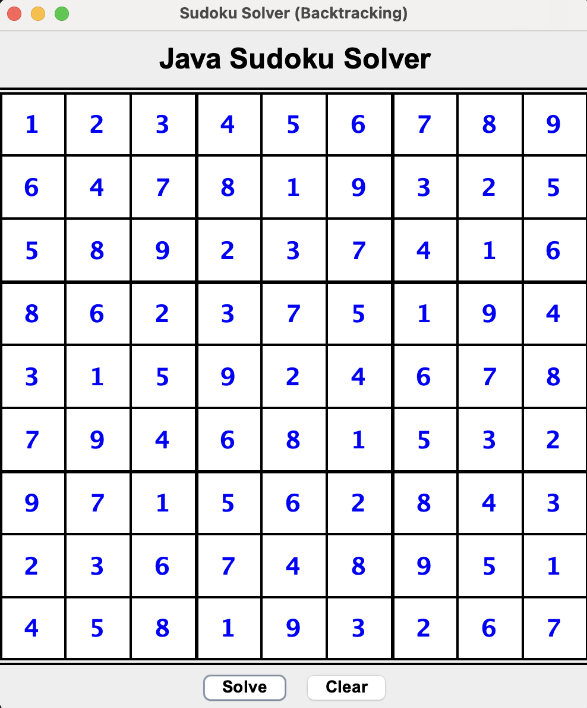

# 🧩 Java Sudoku Solver (Backtracking & Swing)

A sleek, Java-based Desktop application that solves any valid 9x9 Sudoku puzzle instantly using a recursive **Backtracking Algorithm**. The project features a clean Graphical User Interface (GUI) built with **Java Swing**.

## 📖 Overview

This project highlights core Computer Science and Software Engineering principles:
1. **Algorithmic Efficiency:** Implementation of a classic recursive backtracking algorithm to explore and prune decision trees.
2. **Object-Oriented Design (OOP):** Clear separation of concerns between the core logic engine (`SudokuSolver.java`) and the visual presentation layer (`SudokuGui.java`).
3. **Event-Driven Programming:** Handling user interactions and state changes via ActionListeners in Java Swing.



## 🚀 Engineering Highlights

*   **Optimized Backtracking:** The solver (`src/core/SudokuSolver.java`) intelligently checks constraints (row, column, and 3x3 sub-grid) before placing a number, significantly reducing the algorithmic search space.
*   **Input Validation:** The GUI employs a custom `DocumentFilter` (`DigitFilter`) to strictly allow only single-digit inputs (1-9) at the keystroke level, ensuring engine stability.
*   **Intuitive UI / UX:** Built with `JFrame` and `JPanel`, featuring dynamic compound borders that mathematically render the thick 3x3 Sudoku sub-grids natively without external graphical assets.

## 📁 Directory Structure

```text
java-sudoku-solver/
├── src/
│   ├── core/
│   │   └── SudokuSolver.java    # Core recursive logic
│   └── gui/
│       └── SudokuGui.java       # Swing user interface
├── bin/                         # Compiled .class files (git-ignored)
├── docs/                        # Screenshots and documentation
├── .gitignore                   # Standard Java ignore rules
└── README.md                    # Project documentation
```

## ⚙️ How to Run

1. Clone the repository to your local machine:
   ```bash
   git clone https://github.com/leonardoalunno/java-sudoku-solver.git
   ```
2. Navigate to the root directory and compile the Java source files:
   ```bash
   javac -d bin src/core/*.java src/gui/*.java
   ```
3. Run the application:
   ```bash
   java -cp bin gui.SudokuGui
   ```
4. **Usage:** Enter your known Sudoku numbers into the grid and click **Solve**. The algorithm will fill in the remaining blue numbers instantly. Click **Clear** to reset the board.

---

> **_Leonardo Alunno_**  
> _Aspiring Computer Engineer_  
> 🔗 [LinkedIn](https://www.linkedin.com/in/leonardo-alunno-3095922b7)
